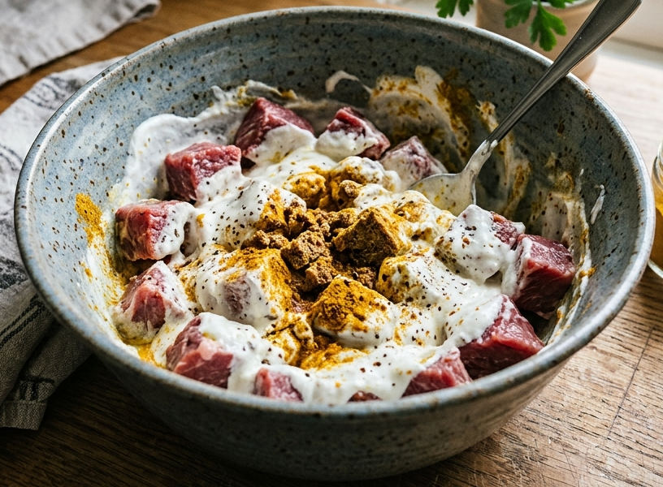
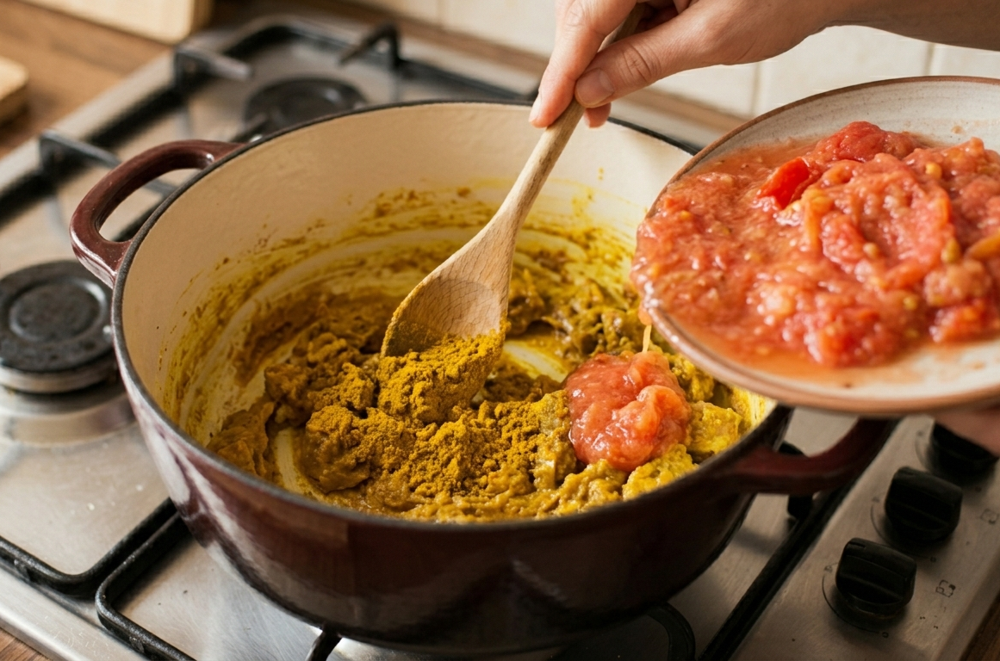
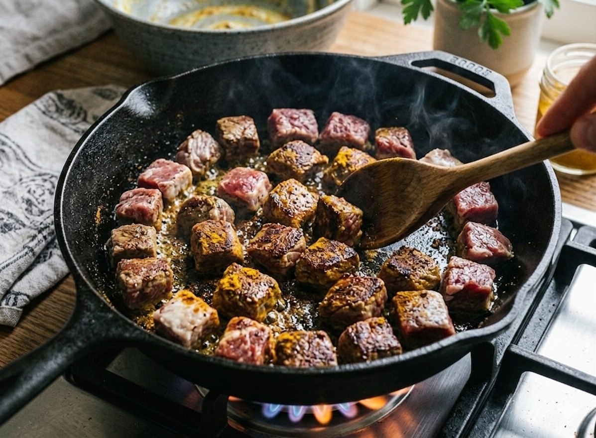

# Arroz com Curry da Kokoro

> *Um curry caseiro, afetivo e encorpado — feito com carinho, camadas de sabor e segredos que fazem toda a diferença.*

Este prato é a minha versão pessoal de um curry brasileiro com alma japonesa. Inspirado no famoso **Arroz com Curry da Kokoro**, essa receita tem molho espesso, carne macia e um toque secreto de maçã que equilibra tudo. Rende **10 porções** — perfeito para servir **5 pessoas com repetição** (e elas vão pedir!).

---

## Ingredientes

### Base
- **5 tomates** grandes e "gordinhos"
- **1 cubo** de caldo de carne
- Água para cozimento (a reservar!)

### Legumes
- **10 batatas** médias
- **5 cenouras**
- **1 sachê** de tempero "7 Vegetais"
- Sal a gosto

### Carne
- **2 kg** de carne bovina (acém ou patinho), em cubos médios
- **1 pote** de iogurte natural integral
- **Gengibre** fresco ralado a gosto
- **1 colher (sopa)** de curry em pó
- **Pimenta-do-reino** a gosto
- **Páprica defumada** (pouca quantidade)

### Temperos e Molho
- **1 cebola** picada
- **1 dente de alho** picado
- **Bacon** picado a gosto
- **1 colher (sopa)** de manteiga
- **3 colheres (sopa)** de farinha de trigo
- **2 colheres (sopa)** de curry em pó
- **½ maçã** (para ralar no final)
- Fio de óleo

---

## Passo a Passo

### Etapa 1 — Base de Tomate e Caldo

1. Lave os **5 tomates** e faça um corte superficial em **"X"** na parte de baixo de cada um.
2. Coloque-os em uma panela com o corte virado para cima, cubra com água e adicione **1 cubo de caldo de carne**. Leve ao fogo.
3. Assim que a pele começar a soltar, retire os tomates da água.

> **Segredo:** Não descarte essa água! Reserve-a — ela vai dar profundidade ao molho.

4. Remova as cascas e a "tampinha" de cima. Em um prato, **amasse bem os tomates com um garfo** até formarem uma polpa rústica.

---

### Etapa 2 — Cozimento dos Legumes

1. Lave, descasque e corte as **10 batatas** e as **5 cenouras** em cubos médios.
2. Cozinhe em uma panela com água, **1 sachê de "7 Vegetais"** e uma pitada de sal.

> ⚠️ **Ponto Ideal:** Deixe os legumes **al dente** — macios, mas ainda firmes. Eles vão terminar de cozinhar no molho e não devem desmanchar.

3. Escorra os legumes e **reserve a água do cozimento** em um recipiente separado. Ela será usada para ajustar o molho no final.

---

### Etapa 3 — Marinada da Carne

1. Se comprou a peça inteira, corte os **2 kg de carne** em cubos médios uniformes.
2. Em uma tigela grande, tempere a carne com:
   - **Iogurte natural** (o pote inteiro)
   - **Gengibre fresco ralado** a gosto
   - **1 colher (sopa) de curry**
   - **Pimenta-do-reino** a gosto
   - **Páprica defumada** (pouca quantidade — ela é intensa!)

3. Misture bem e deixe a carne descansar para absorver todos os aromas.

> **Dica:** Quanto mais tempo a carne marinar, mais saborosa ela fica. Se possível, deixe na geladeira por **pelo menos 30 minutos**. Essa combinação vai dar à carne uma camada extra de sabor e uma cor ainda mais bonita por causa da páprica!

---

### Etapa 4 — O Roux e o Molho de Curry 

1. Em uma **panela grande**, refogue **1 cebola** e **1 dente de alho** picados com o **bacon** e um fio de óleo, até dourarem.
2. Adicione **1 colher de manteiga** e **3 colheres de farinha de trigo**. Mexa sem parar até formar uma pasta dourada.

> **O que é o Roux?** Essa pasta de manteiga + farinha é a base que vai encorpar e dar estrutura ao molho. Não pule essa etapa!

3. Acrescente as **2 colheres de curry** e, em seguida, adicione **a polpa de tomate amassada**.
4. Vá despejando aos poucos a **água reservada do cozimento dos tomates**, mexendo bem até o molho reduzir e ganhar consistência.

---

### Etapa 5 — Selagem da Carne

1. Em **outra panela**, refogue mais um pouco de alho e cebola com um fio de óleo.
2. Adicione a **carne marinada** e mexa de tempos em tempos para não queimar no fundo.
3. Refogue até que a carne esteja **selada, seca e bem douradinha**.

> ⚠️ **Atenção:** Selar a carne separadamente é essencial para travar o sabor da marinada e criar uma casquinha dourada. Não pule essa etapa nem cozinhe direto no molho!

---

### Etapa 6 — Finalização e Integração

1. Despeje a **carne selada** na panela do molho de curry e misture bem.
2. Se o molho estiver muito raso, adicione a **água reservada do cozimento dos legumes** aos poucos.
3. Deixe cozinhar em **fogo baixo** para o molho engrossar.
4. Na metade do processo, adicione os **legumes cozidos** e misture com cuidado para não desmanchar.
5. **O Passo Final:** Rale **½ maçã** diretamente na panela e mexa bem.

> **Segredo da Maçã:** A maçã ralada equilibra o sabor do curry, reduz a acidez e deixa o molho naturalmente mais adocicado e redondo. É o toque que faz toda a diferença!

6. Quando o molho estiver **bem grosso e encorpado**, está pronto para servir!

---

## Sugestão de Consumo

Sirva o curry sobre um **arroz branco soltinho** — ele é o par perfeito para absorver todo aquele molho encorpado.

> **Este prato fica ainda melhor no dia seguinte** — o molho apura e os sabores se integram ainda mais. Guarde as sobras na geladeira por até 3 dias.

---

  Feito com 🧡 por <strong>IasminMoreira</strong>

